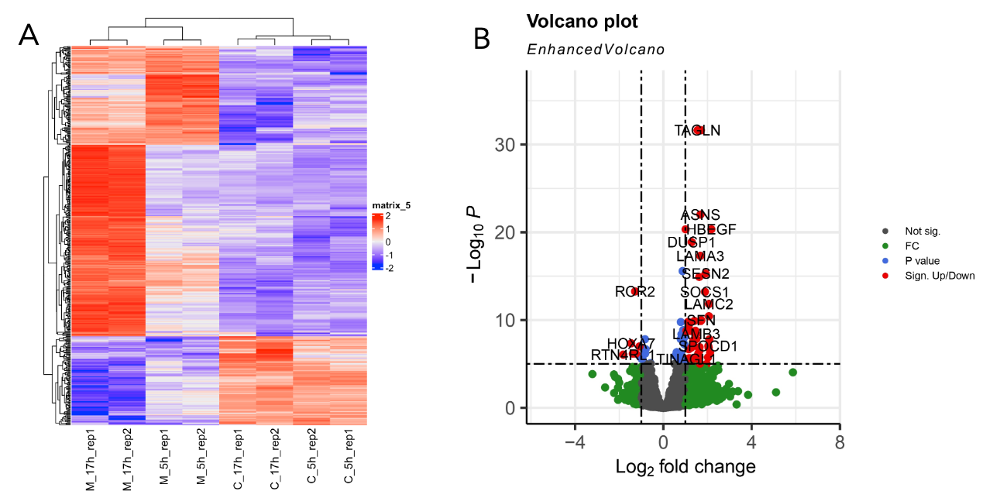
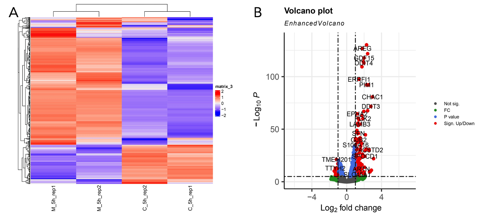
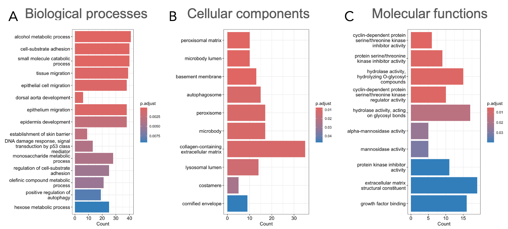
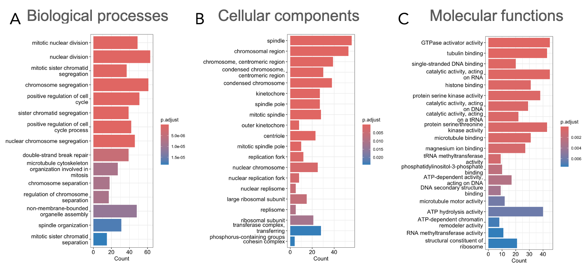
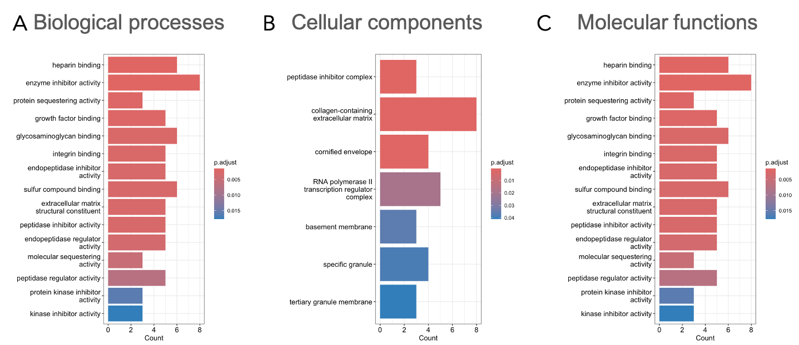

# Effects of mitochondrial disfunction 

Usalka O., Aysin S., Suleimanov S.

*Skoltech, Life Science, NGS course*

## Introduction
The disruption of most mitochondrial genes leads to severe alterations in cell functioning. The knowledge of mechanisms of these alterations can give a key on how to cure diseases resulting from the mutations in mitochondrial genes. In this experiment, the cells were treated with a reagent that suppresses the activity of mitochondrial electron transfer chain and the transcriptomes of control and treated cells were sequenced. You need to find the genes that change their expression profiles and try to understand what are the processes associated with these changes.

## Materials and methods
For analysis RNA-seq (Illumina, 50 nt) of treated and control samples were used. [Fastqc](https://www.bioinformatics.babraham.ac.uk/projects/fastqc/) tool was used quality analysis. After quality check, trimming of reads was performed using [fastp](https://academic.oup.com/bioinformatics/article/34/17/i884/5093234) tool. Indexing of reference genome and mapping of reads to reference genome was performed with [STAR](https://academic.oup.com/bioinformatics/article/29/1/15/272537). [futureCounts](https://academic.oup.com/bioinformatics/article/30/7/923/232889) was used to build full count matrix after STAR mapping. All step of the primary data processing were summarized in bash script. Further analysis of count matrix was performed using R programming languages and [DESeq package](https://genomebiology.biomedcentral.com/articles/10.1186/gb-2010-11-10-r106).

## Results
Correlation analysis was utilized to compare samples within and betweeb different groups. Technical replicates were highly correlated (0.95-1.00), while correlation between several groups was about 0.4-0.6. Clustering analysis with dendrogram visualization was performed to see the interrelation between groups. 

After that, we have decided to compare expression profile between controls and 2 treatment times. Comparing to control, incubation of cells with myxothiazole led to subsequent upregulation of gene expression. On the volcano plot one can observe higher amount of upregulated genes comparing to downregulated. Most of the genes didn't have significant expression level (>= 0.05), so that they were excluded from the analysis. 

Applying the same methodology independently to the groups, incubated with myxothiazole for 5 and 17 hours (h), we had observed that number of significantly up- or down-regulated genes was significantly higher in the group after 17h of incubation rather than 5h, so that's why we fosuced on 17h incubation group of genes.

After identifing candidate genes we have performed GO enrichment analyses to look at the biological and molecular pathways and processes which migth be involved to the mythochondrial dysfunction. Firstly, we studied upregulated genes.

During this step of analysis we didn't observe anything connected to mitochondrial dysfunction, so that further we performed GO enrichment analysis for downregulated genes and observed that a lot of clusters are bound to cell division, DNA replication and cell cycle in whole which means that the treatment may inhibit the basic cell machinery of mitosis and interfere the cell cycle. 

Looking back on the GO enrichment of upregulated genes, we observed some of the clusters of cyclin-dependent inhibitory kinases and autopjagosome, which migth be also an marker of cell death due to the treatment.

But still we wanted to understand what genes are stringently up or down regulated even after 5 and 17 hours of treatment with myxothiazole. We performed intersection analysis to identify candidate for further GO enrichemnt analysis. We have observed 60 genes which were upregulated in both time groups, but only 13 genes which were downregulated. 

Due to low number of candidates, the GO enrichment analysis of this group didn't reveal any significant results for downregulated genes, but some clusters were identified for upregulated genes.

Finally, using human genes database ENSEMBLE we have extracted the IDs for mitochondrial genes. It is well known that mitochondrial genome is partially low in amount of genes encoded, there are only 37 genes around. We have identified 10 dowregulated and 2 upregulated genes from the mitochondrial genome. Interestingly, all downregulated genes were gene coding tRNAs, while upregulated genes - genes coding rRNAs. tRNA genes downregulation is also a marker of subsequent protein synthesis inhibition in terms of electron-transport chain blockage. 

## Summary

To summarize, cells exposed to myxothiazole change expression profiles and inhibit all main cellular functions, including cell cycle control, mitosis, DNA replication and protein synthesis. ALso mitochondrial genomes is affected, as 10 of 37 genes (encoding tRNAs) were stringently downregulated due to low protein synthesis level. 

## Data availability

Bash and R scripts for the analysis migth be found in *bash* and *Rscript* folders, respectively.